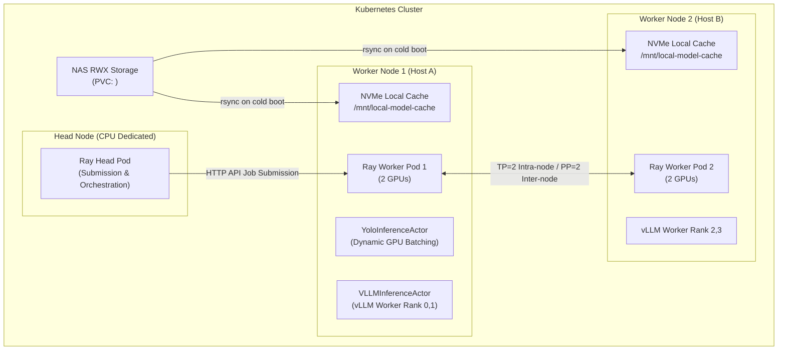

# KubeRay + vLLM 분산 서빙 구축 및 트러블슈팅 종합 가이드

본 문서는 KubeRay와 vLLM을 활용하여 **2개 노드, 4대 GPU 환경**에서 **Qwen3.5-27B-FP8** 모델을 분산 서빙(`TP=2, PP=2`)하며 구축한 엔터프라이즈 아키텍처, 9대 핵심 유의사항 및 트러블슈팅 내역, 그리고 완전 익명화(Anonymized) 처리된 최종 매니페스트를 정리한 가이드입니다.

---

## 1. 아키텍처 개요



### 주요 스펙 및 전략
* **대상 모델:** `Qwen3.5-27B-FP8` (가중치 약 30GB)
* **하드웨어 인프라:** 2개 물리 노드, 노드당 GPU 2대 (총 GPU 4대, VRAM 96GB)
* **병렬화 전략:** `Tensor Parallelism (TP) = 2`, `Pipeline Parallelism (PP) = 2`
  * 노드 내부 2대 GPU는 고속 Intra-node 통신 (`TP=2`)
  * 노드 간 2대는 파이프라인 Inter-node 통신 (`PP=2`)
* **자원 관리 전략 (Scale-to-Zero):**
  * 평상시: 저렴한 CPU 전용 Head 파드만 가동 (`minReplicas: 0`)
  * 배치 작업 요청 시: GPU Worker 파드 2개 자동 스케일업 (`maxReplicas: 2`)
  * 작업 완료 후: 5분(300초) 유휴 상태 지속 시 GPU 파드 자동 반납
* **가중치 캐싱 전략:** NAS (RWX PVC) $\rightarrow$ 물리 노드 NVMe 디스크(`hostPath`) 조건부 복사 (`rsync` 기반 진행률 모니터링)
* **Ray Dual-Actor 아키텍처:**
  * `YoloInferenceActor`: GPU VRAM을 동적으로 감지하여 배치 크기(8/16/32)를 자동 조정하며 슬라이딩 윈도우 탐지 수행
  * `VLLMInferenceActor`: CPU 전용 Head 노드의 플랫폼 감지 실패를 우회하기 위해 GPU Worker 노드에 전용 Actor 배치

---

## 2. 구축 시 핵심 유의사항 및 트러블슈팅 (Post-Mortem 9대 이슈)

### [이슈 1] 코드 내 vLLM 분산 실행 충돌 (`RAY_ADDRESS`)
* **현상:** KubeRay 환경에서 파이썬 코드를 실행할 때 vLLM이 기존 Ray 클러스터를 찾지 못하고 로컬 인-프로세스 Ray를 별도로 띄우려다 충돌 발생.
* **원인:** vLLM `LLM()` 인스턴스 생성 전 KubeRay 클러스터 연결 지정(`ray.init()`) 누락.
* **유의사항 및 해결:** 파이썬 코드 상단에 KubeRay 환경변수(`RAY_ADDRESS`)를 참조하는 접속 로직 추가.
```python
if not ray.is_initialized():
    ray_address = os.getenv("RAY_ADDRESS", "auto")
    ray.init(address=ray_address, ignore_reinit_error=True)
```

---

### [이슈 2] `initContainer` 복사 무소음 실패 방지 (`set -e` & `rsync` 모니터링)
* **현상:** NAS에서 노드 NVMe 디스크로 가중치를 복사할 때 데이터가 누락되어도 메인 컨테이너가 가동되어 vLLM 크래시 발생.
* **원인:** Shell 스크립트 에러 검증 누락 및 단순 `cp` 사용 시 전송률 모니터링 불가능.
* **유의사항 및 해결:** 
  1. `initContainer`에 `set -e` 설정 및 NAS 경로 존재 여부, 복사 후 디렉토리 비어있음 여부를 명시적으로 체크하여 실패 시 파드를 `Init:Error`로 즉시 처리.
  2. `alpine` 이미지 기반으로 `rsync -avhP`를 적용하여 `kubectl logs`로 실시간 전송 속도 및 복사 진행률(%) 출력.

---

### [이슈 3] Head 파드 무한 재부팅 (`wget` 및 `ray[default]` 미설치)
* **현상:** Head 파드가 `1/2 READY` 상태로 머물다 `Killing` 되며 재부팅 반복.
* **원인:** 
  1. KubeRay 헬스체크(Probe) 실행 시 `wget` 명령어를 사용하나 도커 이미지에 `wget` 미설치.
  2. Dockerfile에 `ray` 기본 패키지만 설치되어 대시보드/GCS HTTP API 엔드포인트 비활성화.
* **유의사항 및 해결:** Dockerfile에 필수 도구 명시
  * `apt-get install -y wget curl procps`
  * `pip install "ray[default]"` (대시보드 및 HTTP 헬스체크 API 활성화)

---

### [이슈 4] AI 모델 부팅 지연으로 인한 Liveness Probe 실패
* **현상:** `wget` 설치 후에도 Head 파드가 부팅 중 강제 종료 현상 발생.
* **원인:** KubeRay 기본 Probe의 `failureThreshold` 생략 시 기본값 `3` 적용. Heavy한 AI 패키지가 부팅되는 동안 60초 만에 k8s가 파드를 포착 실패로 간주하고 종료시킴.
* **유의사항 및 해결:** 이미지에 `ray[default]`와 `wget`이 상주하도록 구성한 후 KubeRay 표준 내장 Probe가 자연스럽게 통과하도록 설정 (필요시 `failureThreshold: 30`, `timeoutSeconds: 5` 지정).

---

### [이슈 5] 대용량 도커 이미지 반복 Pull 병목 (`imagePullPolicy: IfNotPresent`)
* **현상:** Worker 파드가 오토스케일링될 때마다 대용량 도커 이미지를 다시 내려받느라 3~4분씩 지연.
* **원인:** `:latest` 태그 사용으로 인해 `imagePullPolicy: Always` 강제 적용.
* **유의사항 및 해결:** 태그 명시(`:20260730`) 및 `imagePullPolicy: IfNotPresent` 적용으로 노드 디스크 캐시 활용 (부팅 시간 0초 단축).

---

### [이슈 6] KubeRay Operator Panic (`submissionMode: "HTTPMode"`)
* **현상:** `RayJob` 제출 시 KubeRay Operator가 Panic 에러(`Exit Code: 2`, `nil pointer dereference`)를 뱉으며 다운.
* **원인:** 기존 클러스터를 재사용(`clusterSelector`)하면서 기본 제출 모드인 `K8sJobMode`를 사용하면, 제출용 파드를 만드는 과정에서 `rayClusterSpec` 메모리 주소를 참조하려다 `nil` 에러 발생 (KubeRay Operator 버그).
* **유의사항 및 해결:** `RayJob` 스펙에 `submissionMode: "HTTPMode"`를 명시하여 오퍼레이터가 제출용 파드 생성 없이 Head 대시보드 REST API로 작업을 직접 전달하도록 변경.

---

### [이슈 7] CPU Head 노드의 vLLM 디바이스 감지 실패 (`VLLMInferenceActor`)
* **현상:** `RayJob` 제출 시 `RuntimeError: Device string must not be empty` 발생.
* **원인:** CPU 전용 Head 노드에는 GPU가 없어 vLLM 0.18의 플랫폼 로직이 디바이스 타입을 빈 문자열(`""`)로 감지하고 `torch.device("")` 호출 시 크래시 발생.
* **유의사항 및 해결:** `VLLMInferenceActor` (Ray Remote Actor)를 작성하여 `LLM()` 인스턴스 생성을 실제 GPU가 존재하는 Worker 노드로 위임.

---

### [이슈 8] `kuberay-operator` 무한 재부팅 (`leader election lost`)
* **현상:** 멀티노드 스케일업 시 `kuberay-operator` 파드가 `leader election lost` 에러를 뱉으며 무한 재부팅(`Restart Count: 7`)되고, `VLLMInferenceActor`에서 `RuntimeError: Engine core initialization failed` 발생.
* **원인:** `kuberay-operator` 파드의 기본 CPU Limit이 `100m` (0.1 코어)로 극도로 적어 멀티노드 스케일업 시 리더십 갱신(Leader Election Lease) 타임아웃 발생. 이로 인해 오퍼레이터가 순간적으로 죽으면서 Ray Dashboard와의 HTTP 연결이 끊김.
* **유의사항 및 해결:** `kubectl set resources deployment kuberay-operator -n default --limits=cpu=1,memory=1Gi --requests=cpu=500m,memory=512Mi` 명령으로 Operator CPU 리소스 증설.

---

### [이슈 9] Triton JIT 컴파일러 부재 및 한글 파일명 인코딩 문제
* **현상 1:** `RuntimeError: Failed to find C compiler. Please specify via CC environment variable` 발생.
* **현상 2:** Mac/Linux 간 한글 파일명 경로 인식 불일치로 `FileNotFoundError` 발생.
* **원인 1:** vLLM이 Rotary Embedding 등을 계산할 때 Triton 커널을 실시간(JIT) C/CUDA 컴파일하나, 컨테이너 내 `gcc`/`g++` 미설치.
* **원인 2:** 파일 시스템 간 Unicode NFD(조합형) / NFC(완성형) 인코딩 차이.
* **유의사항 및 해결:**
  1. Dockerfile에 `gcc g++ build-essential` 패키지 설치.
  2. 파이썬 `unicodedata.normalize('NFC', str(path))`를 적용하여 한글 경로 정규화.
  3. `ray-job.yaml` `runtimeEnvYAML`에 `LANG: "C.UTF-8"`, `LC_ALL: "C.UTF-8"`, `PYTHONIOENCODING: "utf-8"` 환경변수 명시.

---

## 3. 최종 설정 매니페스트 모음 (익명화 버전)

### ① `Dockerfile` (vLLM + Triton + Ray 표준 배포 환경)

```dockerfile
# 1. vLLM 구동을 위한 CUDA 포함 PyTorch 베이스 이미지
FROM pytorch/pytorch:2.1.2-cuda12.1-cudnn8-runtime

# 2. 환경 변수 설정
ENV PYTHONDONTWRITEBYTECODE=1
ENV PYTHONUNBUFFERED=1
ENV DEBIAN_FRONTEND=noninteractive

# 3. OpenCV, Triton JIT 컴파일러(gcc/g++) 및 시스템 필수 라이브러리 설치
RUN apt-get update && apt-get install -y --no-install-recommends \
    libgl1 \
    libglib2.0-0 \
    git \
    wget \
    curl \
    procps \
    gcc \
    g++ \
    build-essential \
    && apt-get clean && rm -rf /var/lib/apt/lists/*
WORKDIR /app

# 4. 파이썬 패키지 의존성 설치
COPY ./requirements.txt /app/requirements.txt
RUN pip install --no-cache-dir -r /app/requirements.txt

# 5. 사내/프라이빗 의존성 라이브러리 설치
RUN --mount=type=secret,id=GIT_TOKEN \
    pip install --no-cache-dir "git+https://x-token-auth:$(cat /run/secrets/GIT_TOKEN)@github.com/<YOUR_ORGANIZATION>/<UTILITY_REPO>.git"
RUN --mount=type=secret,id=GIT_TOKEN \
    pip install --no-cache-dir "git+https://x-token-auth:$(cat /run/secrets/GIT_TOKEN)@github.com/<YOUR_ORGANIZATION>/<EVALUATION_REPO>.git"

# 6. 소스코드 및 가중치 복사
COPY ./src/ /app/src
COPY ./weights/ /app/weights

WORKDIR /app/src

# 7. 엔트리포인트 지정
ENTRYPOINT ["python", "XAI_Captioning.py"]
```

---

### ② `KubeRay_cluster.yaml` (Scale-to-Zero 지원 클러스터)

```yaml
apiVersion: ray.io/v1
kind: RayCluster
metadata:
  name: qwen-2node-cluster
  namespace: default
spec:
  rayVersion: '2.9.0'
  # 1) 내장 자동 확장(Autoscaling) 활성화
  enableInTreeAutoscaling: true
  autoscalerOptions:
    upscalingMode: Default
    idleTimeoutSeconds: 300 # 작업 완료 후 5분간 유휴 상태면 GPU Worker 자동 반납 (replicas: 0)
  
  # 2) Head 노드 (CPU 전용 상시 대기 파드)
  headGroupSpec:
    rayStartParams:
      dashboard-host: '0.0.0.0'
    template:
      spec:
        containers:
        - name: ray-head
          image: <YOUR_REGISTRY_DOMAIN>/<PROJECT>/<IMAGE_NAME>:<TAG>
          imagePullPolicy: IfNotPresent # 노드에 캐싱된 이미지 즉시 사용
          resources:
            limits:
              cpu: "4"
              memory: "32Gi"
            requests:
              cpu: "2"
              memory: "8Gi"
          volumeMounts:
            - mountPath: /dev/shm     # vLLM NCCL 통신용 공유 메모리
              name: dshm
            - mountPath: /root/.cache/huggingface # vLLM 가중치 로컬 캐시 매핑
              name: node-local-cache
            - mountPath: /data
              name: nas-volume
              readOnly: true
            - mountPath: /results
              name: nas-result
        volumes:
        - name: dshm
          emptyDir:
            medium: Memory
            sizeLimit: "16Gi"
        - name: nas-volume
          persistentVolumeClaim:
            claimName: <YOUR_MODELS_PVC> # NAS 연동 RWX PVC
        - name: nas-result
          persistentVolumeClaim:
            claimName: <YOUR_RESULTS_PVC>
        - name: node-local-cache
          hostPath:
            path: /mnt/local-model-cache # 물리 서버 노드의 NVMe 디렉토리
            type: DirectoryOrCreate
              
  # 3) Worker 노드 (각 노드당 GPU 2대 할당, 총 2개 Pod = GPU 4대)
  workerGroupSpecs:
  - groupName: gpu-nodes
    minReplicas: 0    # 평상시에는 GPU Pod 0대 (비용/자원 점유 0)
    maxReplicas: 2    # 배치 작업 들어오면 Pod 2개 생성 (각 Pod당 GPU 2대 = 총 4대)
    rayStartParams:
      object-store-memory: "10737418240"
    template:
      spec:
        # 서로 다른 2개의 물리 노드에 Pod가 1개씩 쪼개지도록 강제
        affinity:
          podAntiAffinity:
            requiredDuringSchedulingIgnoredDuringExecution:
            - labelSelector:
                matchExpressions:
                - key: ray.io/group
                  operator: In
                  values: ["gpu-nodes"]
              topologyKey: "kubernetes.io/hostname"
              
        # [조건부 initContainer] 물리 노드의 hostPath에 가중치가 없으면 NAS에서 rsync 복사
        initContainers:
        - name: model-cache-initializer
          image: alpine:latest
          command:
          - sh
          - -c
          - |
            set -e

            # 0. rsync 패키지 설치
            echo "=== Installing rsync ==="
            apk add --no-cache rsync

            TARGET_DIR="/local-cache/Qwen3.5-27B-FP8"
            NAS_DIR="/nas-mount/huggingface_models/Qwen/Qwen3.5-27B-FP8"

            echo "=== Checking Local NVMe Model Cache ==="

            # 1. 로컬 노드 디스크에 이미 가중치 디렉토리가 있고 파일이 존재하는지 검사
            if [ -d "$TARGET_DIR" ] && [ "$(ls -A "$TARGET_DIR" 2>/dev/null)" ]; then
              echo "[SUCCESS] Model cache found on this node. Skipping copy."
              exit 0
            fi

            echo "[CACHE MISS] Local model cache not found."
            echo "=== Checking NAS Source Directory ==="

            # 2. NAS 원본 디렉토리 존재 검사
            if [ ! -d "$NAS_DIR" ] || [ -z "$(ls -A "$NAS_DIR" 2>/dev/null)" ]; then
              echo "[FATAL ERROR] NAS source directory ($NAS_DIR) does not exist or is empty!" >&2
              exit 1
            fi

            # 3. rsync를 통한 실시간 전송률 및 진행 상태 출력 복사
            echo "Copying Qwen3.5-27B-FP8 from NAS to Node Local Storage via rsync..."
            mkdir -p "$TARGET_DIR"
            rsync -avhP "$NAS_DIR/" "$TARGET_DIR/"

            # 4. 복사 후 최종 검증
            if [ -z "$(ls -A "$TARGET_DIR" 2>/dev/null)" ]; then
              echo "[FATAL ERROR] Copy failed or target directory is empty after rsync!" >&2
              exit 1
            fi

            echo "[SUCCESS] Model weights successfully cached to local node NVMe."
          volumeMounts:
          - mountPath: /nas-mount
            name: nas-volume
            readOnly: true
          - mountPath: /local-cache
            name: node-local-cache

        containers:
        - name: ray-worker
          image: <YOUR_REGISTRY_DOMAIN>/<PROJECT>/<IMAGE_NAME>:<TAG>
          resources:
            limits:
              nvidia.com/gpu: "2"   # 노드당 GPU 2대 요청
              cpu: "12"
              memory: "48Gi"
            requests:
              nvidia.com/gpu: "2"
              cpu: "8"
              memory: "32Gi"
          volumeMounts:
          - mountPath: /dev/shm
            name: dshm
          - mountPath: /root/.cache/huggingface
            name: node-local-cache
          - mountPath: /data
            name: nas-volume
            readOnly: true
          - mountPath: /results
            name: nas-result

        volumes:
        - name: dshm
          emptyDir:
            medium: Memory
            sizeLimit: "16Gi"
        - name: nas-volume
          persistentVolumeClaim:
            claimName: <YOUR_MODELS_PVC>
        - name: nas-result
          persistentVolumeClaim:
            claimName: <YOUR_RESULTS_PVC>
        - name: node-local-cache
          hostPath:
            path: /mnt/local-model-cache
            type: DirectoryOrCreate
```

---

### ③ `KubeRay_job.yaml` (HTTPMode 작업 제출 매니페스트)

```yaml
apiVersion: ray.io/v1
kind: RayJob
metadata:
  name: qwen27b-captioning-job
  namespace: default
spec:
  # [핵심] 제출용 파드를 생성하지 않고 REST API로 직접 전달하여 KubeRay 버그 회피
  submissionMode: "HTTPMode"

  clusterSelector:
    ray.io/cluster: qwen-2node-cluster

  entrypoint: >
    python XAI_Captioning.py
    --model_id /root/.cache/huggingface/Qwen3.5-27B-FP8
    --input_folder <YOUR_INPUT_DATA_PATH>
    --output_folder <YOUR_OUTPUT_DATA_PATH>
    --material CONCRETE
    --tensor_parallel_size 2
    --pipeline_parallel_size 2
    --gpu_memory_utilization 0.85
    --job_id 1
    --backend_url <BACKEND_SERVER_IP>

  runtimeEnvYAML: |
    env_vars:
      RAY_ADDRESS: "auto"
      VLLM_TARGET_DEVICE: "cuda"
      VLLM_USE_RAY_COMPILED_DAG: "0"
      VLLM_USE_RAY_SPMD_WORKER: "0"
      PYTHONUNBUFFERED: "1"
      LANG: "C.UTF-8"
      LC_ALL: "C.UTF-8"
      PYTHONIOENCODING: "utf-8"

  metadata:
    job_id: "k8s-captioning-27b-001"

  ttlSecondsAfterFinished: 60
```

---

### ④ 간결한 Ray Remote 분산 서빙 파이프라인 샘플 코드 (`sample_distributed_pipeline.py`)

복잡한 비즈니스 로직을 제외하고 **YOLO 객체 탐지 전처리 Actor**와 **vLLM Qwen 멀티노드 추론 Actor**를 `ray.remote`로 구성하여 분산 파이프라인을 구축하는 가장 명확하고 간결한 인프라 참조 샘플 코드입니다.

```python
import os
import ray
from typing import List

# ----------------------------------------------------
# 1. YOLO 객체 탐지 전처리 Actor (Ray Remote)
# ----------------------------------------------------
@ray.remote
class YoloInferenceActor:
    """GPU Worker 노드에서 YOLO 객체 탐지 및 이미지 크롭 전처리를 담당하는 Ray Actor"""

    def __init__(self, weight_file: str):
        from ultralytics import YOLO
        import torch

        # Worker 파드의 GPU 장치 자동 인식
        self.device = "cuda:0" if torch.cuda.is_available() else "cpu"
        self.model = YOLO(weight_file).to(self.device)

    def process_image(self, img_path: str) -> dict:
        """이미지 경로를 받아 YOLO 객체 탐지 후 크롭 정보 및 BBox 반환"""
        results = self.model(img_path, conf=0.5, verbose=False)
        detected_crops = []

        # YOLO 탐지 결과 바운딩 박스 파싱
        for box in results[0].boxes:
            detected_crops.append({
                "class_id": int(box.cls.item()),
                "bbox": box.xyxy.tolist()[0]
            })

        return {"img_path": img_path, "crops": detected_crops}


# ----------------------------------------------------
# 2. vLLM 기반 Qwen VLM 대규모 분산 추론 Actor (Ray Remote)
# ----------------------------------------------------
@ray.remote
class VLLMInferenceActor:
    """GPU Worker 노드에서 vLLM 멀티노드 엔진(TP=2, PP=2)을 보유하고 VLM 추론을 수행하는 Ray Actor"""

    def __init__(self, model_id: str, tp_size: int = 2, pp_size: int = 2):
        # Head 노드의 디바이스 감지 크래시 방지를 위해 Worker 노드 내부에서 vLLM 초기화
        from vllm import LLM, SamplingParams

        self.llm = LLM(
            model=model_id,
            tokenizer=model_id,
            tensor_parallel_size=tp_size,
            pipeline_parallel_size=pp_size,
            distributed_executor_backend="ray",  # KubeRay 멀티노드 클러스터 호환
            trust_remote_code=True,
            gpu_memory_utilization=0.85,
            enforce_eager=True,
        )
        self.sampling_params = SamplingParams(temperature=0.35, max_tokens=1024)

    def ready(self) -> bool:
        """vLLM 엔진 초기화 완료 여부 확인 헬퍼"""
        return True

    def generate_caption(self, prompt: str, image_payload: dict) -> str:
        """YOLO 탐지 결과 및 이미지 데이터를 조합하여 vLLM 멀티모달 캡셔닝 수행"""
        messages = [
            {
                "role": "user",
                "content": [
                    {"type": "text", "text": prompt},
                    {"type": "text", "text": f"[사전 탐지 정보]: {image_payload['crops']}"}
                ]
            }
        ]
        outputs = self.llm.chat(messages, self.sampling_params)
        return outputs[0].outputs[0].text


# ----------------------------------------------------
# 3. 메인 오케스트레이터 및 분산 실행 파이프라인
# ----------------------------------------------------
def main():
    # KubeRay 클러스터 자동 접속 (RAY_ADDRESS 환경변수 참조)
    if not ray.is_initialized():
        ray.init(address=os.getenv("RAY_ADDRESS", "auto"), ignore_reinit_error=True)

    model_id = "/root/.cache/huggingface/Qwen3.5-27B-FP8"
    yolo_weights = "/app/weights/best.pt"

    # Step 1: YOLO 전처리 Actor 배치 (GPU Worker 노드)
    yolo_actor = YoloInferenceActor.remote(yolo_weights)

    # Step 2: vLLM 분산 추론 Actor 배치 (GPU Worker 노드, TP=2, PP=2)
    vllm_actor = VLLMInferenceActor.remote(model_id=model_id, tp_size=2, pp_size=2)
    
    # vLLM 멀티노드 모델 로딩 완료 대기
    ray.get(vllm_actor.ready.remote())

    # Step 3: 비동기 분산 파이프라인 실행
    test_images = ["<YOUR_INPUT_DATA_PATH>/sample1.jpg", "<YOUR_INPUT_DATA_PATH>/sample2.jpg"]

    for img_path in test_images:
        # A. YOLO 객체 탐지 비동기 수행
        detection_ref = yolo_actor.process_image.remote(img_path)
        detection_result = ray.get(detection_ref)

        # B. vLLM VLM 멀티모달 캡셔닝 비동기 수행
        prompt = "안전진단 전문가 관점에서 결함을 분석하고 종합 의견을 작성해줘."
        caption_ref = vllm_actor.generate_caption.remote(prompt, detection_result)
        caption_result = ray.get(caption_ref)

        print(f"\n==========================================")
        print(f"📷 이미지: {img_path}")
        print(f"📝 VLM 생성 캡션:\n{caption_result}")
        print(f"==========================================")


if __name__ == "__main__":
    main()
```

---

## 4. 운용 가이드 및 모니터링 명령 모음

### ① 클러스터 가동 (1회 배포)
```bash
kubectl apply -f KubeRay_cluster.yaml
```

### ② 배치 작업 제출 (필요시마다 실행)
```bash
kubectl apply -f KubeRay_job.yaml
```

### ③ 실시간 디버깅 및 모니터링 명령

```bash
# 1. 파드 및 오토스케일링 상태 확인
kubectl get pods -l ray.io/cluster=qwen-2node-cluster

# 2. Worker 파드의 rsync 가중치 복사 진행률(%) 실시간 확인
kubectl logs -f <worker-pod-name> -c model-cache-initializer

# 3. Head 파드 전체 시스템 및 Ray 메인 로그 확인
kubectl logs -f <head-pod-name> -c ray-head

# 4. Head 파드 내에서 최근 실행 중인 파이썬 배치(job-driver) stdout/stderr 실시간 스트리밍 ⭐️
kubectl exec -it <head-pod-name> -c ray-head -- sh -c "ls -1t /tmp/ray/session_latest/logs/job-driver-*.log | head -n 1 | xargs tail -n 1000 -f"

# 5. 제출된 RayJob 상세 정보 및 에러 원인 확인
kubectl describe rayjob qwen27b-captioning-job

# 6. kuberay-operator 상태 및 리소스 사용량 확인
kubectl top pod -l app.kubernetes.io/name=kuberay-operator
```
